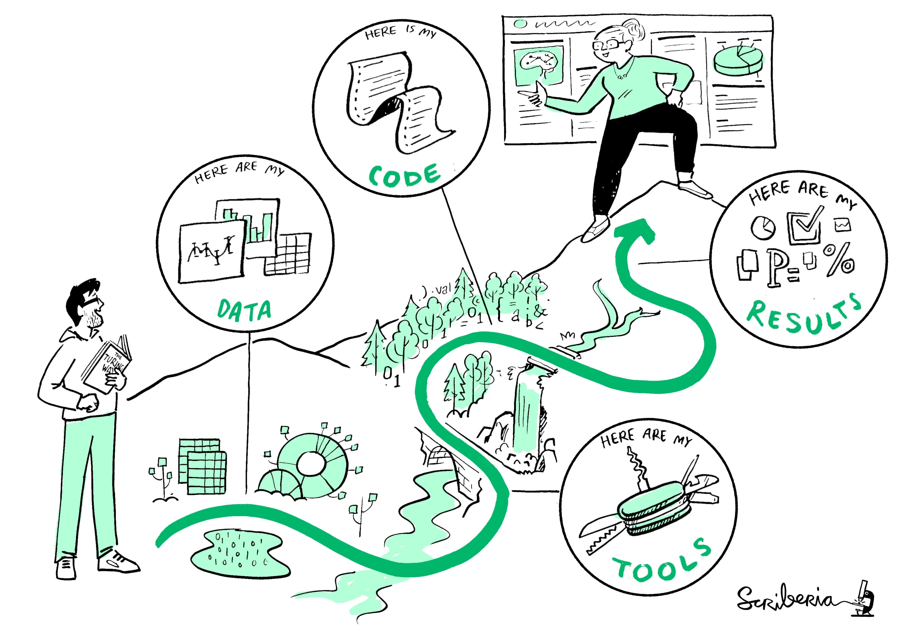

# Hi! I'm Gracielle 👋

:::{.small}
*Open Scholarship Community Manager at SFU  
PhD in Ecology and Evolution (mostly computers)*
:::

:::{.spaced .center .big}

I'm here to make you **STOKED** about Open Science!

:::

---

:::{.big}
Open leaders **design** and **build** projects that **empower** others for understanding, sharing, and participation within inclusive communities.
:::

 

[Open Leadership Framework](mzl.la/olf)  
[Open Science Essentials (2026 SSI fellows training)](https://doi.org/10.5281/zenodo.20920870)

# OS in the research life cycle

::: {.columns}

::: {.column width="30%"}

:::

::: {.column width="70%"}

:::{.spaced}
Alex D., graduate student at the Simon Fraser University.  

They enjoy time outside and on some weekends they go to the local farms
market. 
:::

:::

:::

:::{.notes}
https://book.the-turing-way.org/reproducible-research/overview/#rr-overview-prerequisites

Openness looks different across research areas, methods, and
partnerships, and it’s a process towards responsible research.
Constant self-reflection is a very important practice in any
research trajectory.
:::

# OS in the research life cycle

::: footer
The Turing Way project illustration by Scriberia. Used under a CC-BY 4.0 licence. DOI: [The Turing Way Community & Scriberia (2024)](https://doi.org/10.5281/ZENODO.3332807).
:::

# OS in the research life cycle

::: footer
[Cooperativa de Diseno for OCSDNet, Open Science Manifesto](https://ocsdnet.org/manifesto/open-science-manifesto/).
:::

:::{.notes}
https://sfdora.org/2026/05/25/reimagining-open-science/
:::

## Ideation

:::{.center}
***Take a second look at what you've been reading!***
:::

>[**'Significant' inequalities affect non-white researchers when publishing their work**](https://physicsworld.com/a/significant-inequalities-affect-non-white-researchers-when-publishing-their-work/)  
Researchers who are not white face [...] longer publication delays than white scientists and fewer overall citations. [...] Black researchers in the US are the most under-represented on journal editorial boards.  

## Ideation

:::{.center}
***Take a second look at what you've been reading!***
:::

>[**Women researchers are cited less than men.**](https://www.science.org/content/article/women-researchers-cited-less-men-heres-why-what-can-done)  
*Women’s scientific contributions are often undervalued and cited less often than those of their male counterparts, including in neuroscience, astronomy, medicine—and, according to two new studies, physics.*  

## Ideation

:::{.center}
***Take a second look at what who you're collaborating with!***

{ width=70% }
:::

::: footer
The Turing Way project illustration by Scriberia. Used under a CC-BY 4.0 licence. DOI: [The Turing Way Community & Scriberia (2024)](https://doi.org/10.5281/ZENODO.3332807).
:::

# Exercise 01

::: {.columns}

::: {.column width="30%"}

:::

::: {.column width="70%"}

:::{.spaced}
Which steps can Alex D. take to make their research more open and inclusive in the **ideation** phase?
:::

:::

:::

# Self-reflection minute

Reflecting on the papers I've been reading and the people I've been
collaborating with, who am I missing? How can I invite them to participate?

## Research design and planning

#### Documentation is your best friend!

- Data management plan

- Consent forms

- Pre-registration

# Exercise 02

::: {.columns}

::: {.column width="30%"}

:::

::: {.column width="70%"}

:::{.spaced}
Alex D. is doing research on the effects of climate change on local species. They are planning to collect data from a protected site that is home to several species at risk.

What are the things that might limit openness in Alex D.'s work? How can they address these limitations?
:::

:::

:::

# Self-reflection minute

:::{.left}
What are the things that might limit openness in my work?  

🔘 Sensitive locations (e.g., species at risk, protected sites)  
🔘 Human participants (e.g., interviews, surveys)  
🔘 Indigenous or community-held knowledge  
🔘 Government or NGO partnerships  
🔘 Industry data or contracts  
🔘 Confidential or proprietary information  
🔘 I’m not sure yet  

How can I address these limitations?

:::

## Data collection and analysis

- Data management plan (again!)

- Metadata, archiving, versioning

- Introduce the concept of research software engineering
-- Think about the maintenance of your software!

# [EXERCISE 03]

What is one action I can take to address a gap in my data and software
management current routines?
When can this happen?
What help do I need?

# Dissemination and sharing

- Publishing and sharing
- Licenses
- The AI menace

# Wrap-up and Q&A

