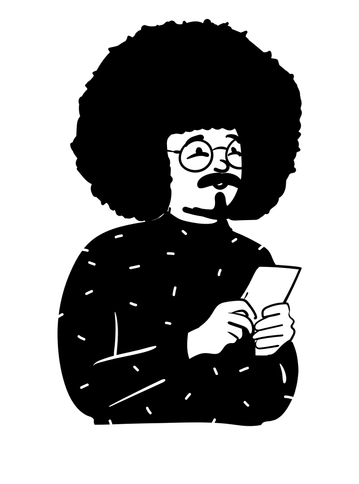
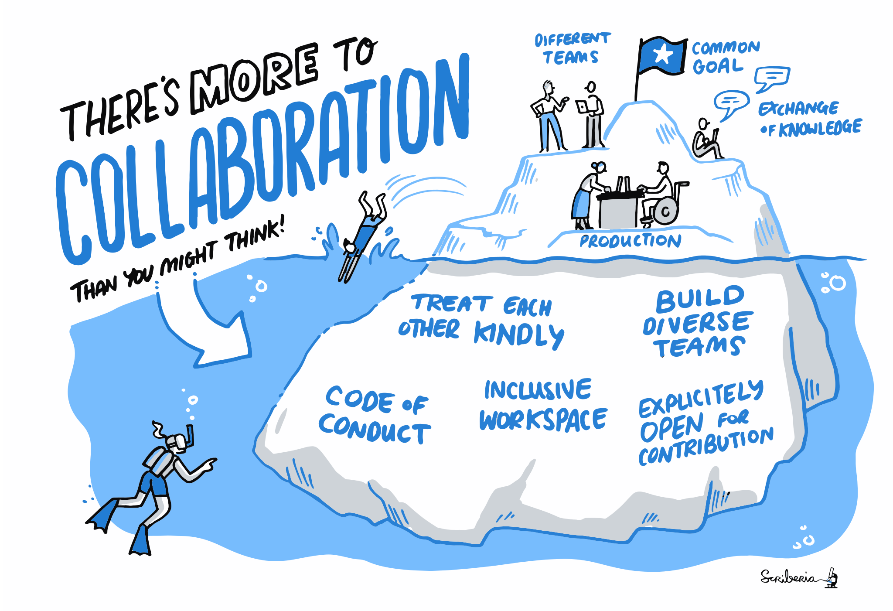
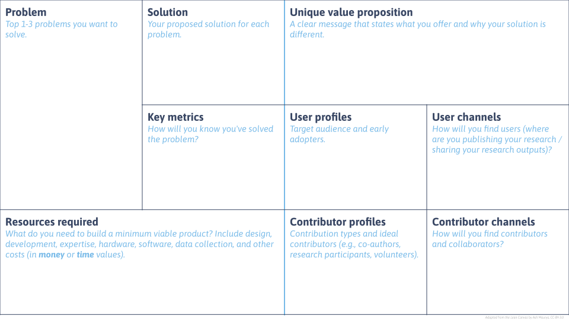

# Hi! I'm Gracielle 👋

:::{.small}
*Open Scholarship Community Manager at SFU  
PhD in Ecology and Evolution (mostly computers)*
:::

:::{.spaced .center .big}

I'm here to make you **STOKED** about Open Science!

:::

---

:::{.big}
Open leaders **design** and **build** projects that **empower** others for understanding, sharing, and participation within inclusive communities.
:::

 

[Open Leadership Framework](mzl.la/olf)  
[Open Science Essentials (2026 SSI fellows training)](https://doi.org/10.5281/zenodo.20920870)

# OS in the research life cycle

::: {.columns}

::: {.column width="30%"}

:::

::: {.column width="70%"}

:::{.spaced}
Alex D., graduate student at the Simon Fraser University.  

They enjoy time outside and on some weekends they go to the local farms
market. 
:::

:::

:::

:::{.notes}
https://book.the-turing-way.org/reproducible-research/overview/#rr-overview-prerequisites

Openness looks different across research areas, methods, and
partnerships, and it’s a process towards responsible research.
Constant self-reflection is a very important practice in any
research trajectory.
:::

# OS in the research life cycle

::: footer
[Cooperativa de Diseno for OCSDNet, Open Science Manifesto](https://ocsdnet.org/manifesto/open-science-manifesto/).
:::

:::{.notes}
https://sfdora.org/2026/05/25/reimagining-open-science/
:::

## Ideation

:::{.center}
***Take a second look at what you've been reading!***
:::

>[**'Significant' inequalities affect non-white researchers when publishing their work**](https://physicsworld.com/a/significant-inequalities-affect-non-white-researchers-when-publishing-their-work/)  
*Researchers who are not white face [...] longer publication delays than white scientists and fewer overall citations. [...] Black researchers in the US are the most under-represented on journal editorial boards.*  

## Ideation

:::{.center}
***Take a second look at what you've been reading!***
:::

>[**Women researchers are cited less than men.**](https://www.science.org/content/article/women-researchers-cited-less-men-heres-why-what-can-done)  
*Women’s scientific contributions are often undervalued and cited less often than those of their male counterparts, including in neuroscience, astronomy, medicine—and, according to two new studies, physics.*  

## Ideation

:::{.center}
***Take a second look at who you're collaborating with!***

{ width=70% }
:::

::: footer
The Turing Way project illustration by Scriberia. Used under a CC-BY 4.0 licence. DOI: [The Turing Way Community & Scriberia (2024)](https://doi.org/10.5281/ZENODO.3332807).
:::

# Exercise 01

::: {.columns}

::: {.column width="30%"}

:::

::: {.column width="70%"}

:::{.spaced}
Which steps can Alex D. take to make their research more open and inclusive in the **ideation** phase?
:::

:::

:::



# Self-reflection minute

Reflecting on the papers I've been reading and the people I've been
collaborating with, who am I missing? How can I invite them to participate?



## Research design and planning

#### Documentation is your best friend!

:::{.center .spaced}
**✨ Data management plan ✨**
:::

> A written document outlining how data for a research project will be collected, documented, formatted, protected and preserved. DMPs may also describe <ins>whether data will be shared</ins>, where it will be deposited for access by others, and whether and when it will be destroyed.  

:::{.small}
[*SFU's Research Data Management Strategy*](https://www.sfu.ca/research/researcher-resources/plan-my-research/compliance/research-data-management.html)
:::

## Research design and planning

#### As open as possible, as closed as necessary.

1. Which aspects of my research should be open and which aspects should be closed? Why?

2. When, how and where should I make my research products available?

3. Time to set up your git repository!

## Research design and planning

::: {.absolute top="50%" left="52%" width="120%" style="transform: translate(-50%, -50%);"}

:::

# Exercise 02



::: {.columns}

::: {.column width="30%"}

:::

::: {.column width="70%"}

:::{.spaced}
Alex D. is doing research on the effects of climate change on local species. They are planning to collect data from a protected site that is home to several species at risk.

What are the things that might limit openness in Alex D.'s work? How can they address these limitations?
:::

:::

:::

# Self-reflection minute



:::{.left}
What are the things that might limit openness in my work?  

🔘 Sensitive locations (e.g., species at risk, protected sites)  
🔘 Human participants (e.g., interviews, surveys)  
🔘 Indigenous or community-held knowledge  
🔘 Government or NGO partnerships  
🔘 Industry data or contracts  
🔘 Confidential or proprietary information  
🔘 I’m not sure yet  

How can I address these limitations?

:::

## Data analysis

#### Version control is your best friend!

:::{.center}
{width="85%"}
:::

::: footer
:::{.small}
*Illustrations from the [Openscapes](https://www.openscapes.org/) blog [GitHub for supporting, contributing, and failing safely](https://www.openscapes.org/blog/2022/05/27/github-illustrated-series/) by Allison Horst and Julia Lowndes.*
:::
:::

## Data analysis

#### Fail publicly!

::: {.columns}

::: {.column width="70%"}

:::{.center}
{width="85%"}
:::

:::

::: {.spaced .column width="30%"}

[Check out the <s>fails</s> repo for these slides here!](https://github.com/open-scholarship-sfu/INN-Research_Bootcamp-OS101/)

:::

:::

::: footer
:::{.small}
*Illustrations from the [Openscapes](https://www.openscapes.org/) blog [GitHub for supporting, contributing, and failing safely](https://www.openscapes.org/blog/2022/05/27/github-illustrated-series/) by Allison Horst and Julia Lowndes.*
:::
:::

## Data analysis

:::{.absolute top="50%" left="52%" width="100%" style="transform: translate(-50%, -50%);"}
:::{.center .big}
Who is going to maintain this piece of code when 
I move on from this position?
:::
:::

# Exercise 03



::: {.columns}

::: {.column width="30%"}

:::

::: {.column width="70%"}

:::{.spaced}
Alex's work builds on a previous study from a postdoc who left their lab two years ago, but did not leave any documentation or the scripts they used to analyse the data. Alex now need to start from scratch...

What are some ways Alex can address this issue and make their own work more transparent and reproducible?

:::

:::

:::

# Self-reflection minute



:::{.left}

What is **one** action I can take to address a gap in my current data and software
management routines?

When can this happen?

What help do I need?

:::

## Dissemination and sharing

#### Where the magic of decentralization of power happens!

> [...] globally researchers have paid around an estimated **US $9 billion in APCs** between 2019 and 2023, distributed across just five major publishers, whose **profit margins approach 38%**. These fees were meant to democratize access but instead <ins>funnel public money into corporate and shareholder pockets at unsustainable scale</ins>.

:::{.small}
*["Why the Economics of Scientific Publishing Need Urgent Reform"](https://www.uottawa.ca/research-innovation/news-all/why-economics-scientific-publishing-need-urgent-reform) by Stefanie Haustein, October 2025.*
:::

## Dissemination and sharing

#### Where the magic of decentralization of power happens!

:::{.center}
{width="65%"}
:::

::: footer
*The Turing Way* project illustration by Scriberia. Used under a CC-BY 4.0 licence. Original version on Zenodo. [Community & Scriberia (2021)](https://doi.org/10.5281/ZENODO.5706310).
:::

## Dissemination and sharing

#### Where the magic of decentralization of power happens!

:::{.center}
{width="75%"}
:::

::: footer
Source: https://bibliotecadigitale.cab.unipd.it/en/digital-library/about-publishing/open-access
:::

## Dissemination and sharing

#### Where the magic of decentralization of power happens!

:::{.center}
{width="65%"}
:::

::: footer
*The Turing Way* project illustration by Scriberia. Used under a CC-BY 4.0 licence. DOI: [The Turing Way Community & Scriberia (2024)](https://doi.org/10.5281/ZENODO.3332807).
:::

## Dissemination and sharing

#### Where the magic of decentralization of power happens!

CRediT taxonomy: [https://credit.niso.org/](https://credit.niso.org/)

::: {.columns}

::: {.column}

Conceptualization

Data curation

Formal analysis

Funding acquisition

Investigation

Methodology

Project administration

:::

::: {.column}

Resources

Software

Supervision

Validation

Visualization

Writing – original draft

Writing – review & editing

:::

:::

# Self-reflection minute



What is **one** thing I could make open in my research  
in the next 6 months?

:::{.spaced .left}
🔘 A preprint or journal article (e.g., via Summit)

🔘 A dataset or dataset metadata (e.g., model outputs)

🔘 Code or analysis scripts (e.g., R, Python, GIS workflows)

🔘 A methods protocol (e.g., sampling, lab, or modelling workflow)

🔘 Conference poster or presentation slides

🔘 A public-facing output (e.g., policy brief, report, blog post)

🔘 Other (what?)

:::

# Wrap-up and Q&A

